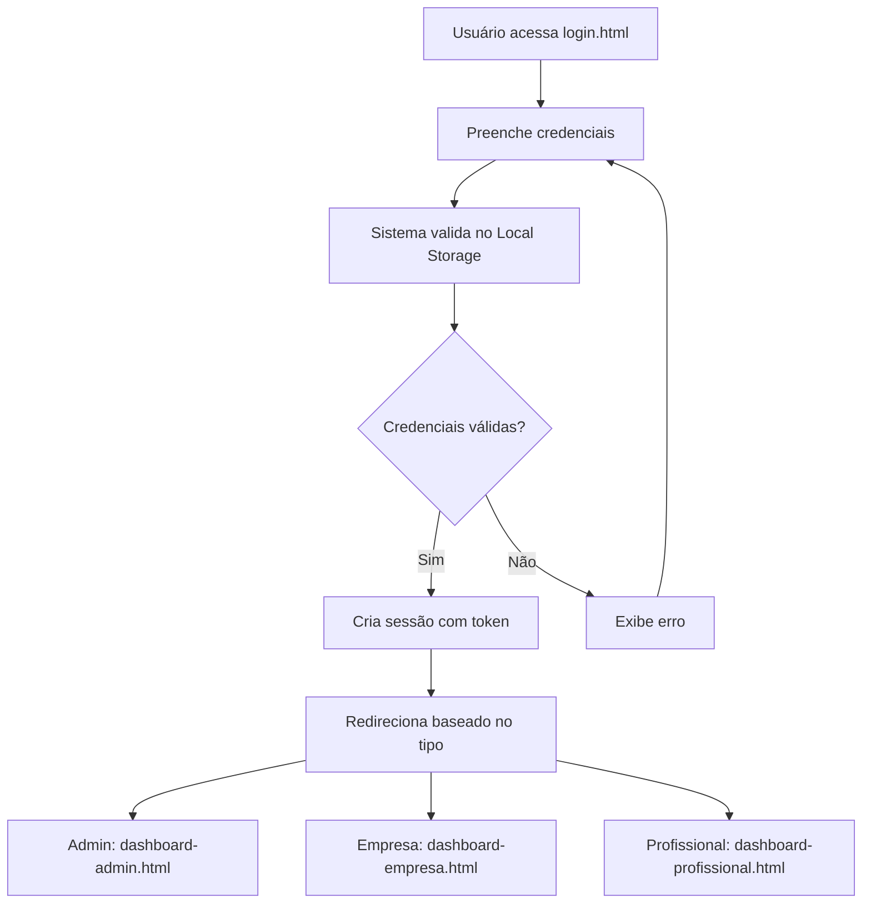

# Sistema de Login com Diferenciação de Usuários e APIs

## 📋 Descrição do Projeto

Este projeto implementa um sistema completo de autenticação com:
- **Login com diferenciação de usuário** (Admin, Empresa, Profissional)
- **Simulação de Banco de Dados** usando Local Storage
- **Consumo de APIs externas** para demonstração
- **Interface responsiva** com Bootstrap 5

## 🏗️ Arquitetura do Sistema

### 1. Sistema de Autenticação (`APIs.js`)

#### Classes Principais:
- **DatabaseSimulator**: Simula BD com Local Storage
- **AuthenticationSystem**: Gerencia login/logout e sessões
- **APIService**: Consome APIs externas
- **UIUtils**: Utilitários para interface

#### Usuários Padrão:
```javascript
// Administrador
Email: admin@fastwork.com
Senha: admin123
Tipo: admin

// Empresa
Email: empresa@exemplo.com  
Senha: empresa123
Tipo: empresa

// Profissional 1
Email: joao@email.com
Senha: joao123
Tipo: profissional

// Profissional 2
Email: maria@email.com
Senha: maria123
Tipo: profissional
```

### 2. APIs Integradas

#### ViaCEP API
- **URL**: `https://viacep.com.br/ws/{cep}/json/`
- **Uso**: Busca informações de endereço por CEP
- **Exemplo**: `apiService.buscarCEP('01310-100')`

#### Quotable API
- **URL**: `https://api.quotable.io/random`
- **Uso**: Obter citações motivacionais
- **Exemplo**: `apiService.obterCitacaoMotivacional()`

#### GitHub API
- **URL**: `https://api.github.com/users/{username}`
- **Uso**: Buscar perfis de usuários GitHub
- **Exemplo**: `apiService.buscarUsuarioGitHub('octocat')`

#### Mock Jobs API
- **URL**: `https://jsonplaceholder.typicode.com/posts`
- **Uso**: Simular vagas de emprego
- **Exemplo**: `apiService.buscarVagas()`

## 🚀 Como Usar

### 1. Fazer Login
1. Acesse `login.html`
2. Use um dos usuários de demonstração ou clique diretamente neles
3. O sistema redirecionará baseado no tipo de usuário

### 2. Testar APIs
- **Na página de login**: Botões de teste de API
- **Na página principal**: Seção de demonstração de APIs
- **No dashboard**: Área completa de testes

### 3. Gerenciar Sessões
- Sessões são mantidas por 24 horas
- Auto-logout quando a sessão expira
- Múltiplas sessões são suportadas

## 🔧 Funcionalidades Técnicas

### Local Storage Structure
```javascript
// Usuários
fastwork_users: [
  {
    id: number,
    email: string,
    password: string,
    type: 'admin'|'empresa'|'profissional',
    name: string,
    avatar: string,
    permissions: string[],
    createdAt: string,
    lastLogin: string
  }
]

// Sessões
fastwork_sessions: [
  {
    token: string,
    userId: number,
    createdAt: number,
    expiresAt: number
  }
]

// Token da sessão atual
fastwork_session_token: string
```

### Permissões por Tipo de Usuário

#### Admin
- `read`, `write`, `delete`, `manage_users`
- Acesso total ao sistema
- Dashboard administrativo

#### Empresa
- `read`, `write`, `post_jobs`
- Pode publicar vagas
- Dashboard de empresa

#### Profissional
- `read`, `apply_jobs`
- Pode se candidatar a vagas
- Dashboard pessoal

## 📱 Responsividade

O sistema é totalmente responsivo:
- **Desktop**: Layout completo com sidebar
- **Tablet**: Layout adaptado
- **Mobile**: Menu hambúrguer e layout em coluna única

## 🎯 Demonstrações Disponíveis

### 1. Página de Login (`login.html`)
- Interface moderna com gradientes
- Usuários de teste clicáveis
- Botões de demonstração de APIs
- Validação de formulário

### 2. Página Principal (`ts1.html`)
- Integração com sistema de auth
- Seção de demonstração de APIs
- Interface adaptada baseada no usuário logado

### 3. Dashboard (`dashboard.html`)
- Estatísticas do sistema
- Teste completo de APIs
- Gerenciamento de dados do Local Storage
- Exportação de dados

## 🔐 Segurança

- Senhas armazenadas em texto plano (apenas para demonstração)
- Tokens de sessão com expiração
- Validação de sessão em cada página
- Logout automático quando sessão expira

## 🚀 Como Executar

1. **Clone o repositório**
2. **Abra `login.html`** em um servidor web local
3. **Use as credenciais de teste** ou clique nos usuários
4. **Explore as funcionalidades** do sistema

### Ordem Recomendada de Teste:
1. `login.html` - Fazer login
2. `ts1.html` - Página principal integrada  
3. `dashboard.html` - Dashboard completo

## 📚 Tecnologias Utilizadas

- **HTML5**: Estrutura semântica
- **CSS3**: Estilos modernos com CSS Grid/Flexbox
- **JavaScript ES6+**: Classes, async/await, arrow functions
- **Bootstrap 5**: Framework CSS responsivo
- **Bootstrap Icons**: Ícones vetoriais
- **Local Storage**: Persistência de dados
- **Fetch API**: Consumo de APIs REST

## 🔄 Fluxo de Autenticação



## 📈 Próximos Passos (Melhorias Futuras)

1. **Hash de senhas** com bcrypt
2. **JWT tokens** para autenticação
3. **Banco de dados real** (MongoDB/PostgreSQL)
4. **API backend** com Node.js/Express
5. **Testes automatizados** com Jest
6. **Deploy** em produção

---

**Desenvolvido para demonstração de habilidades em desenvolvimento frontend com integração de APIs e gerenciamento de estado.**